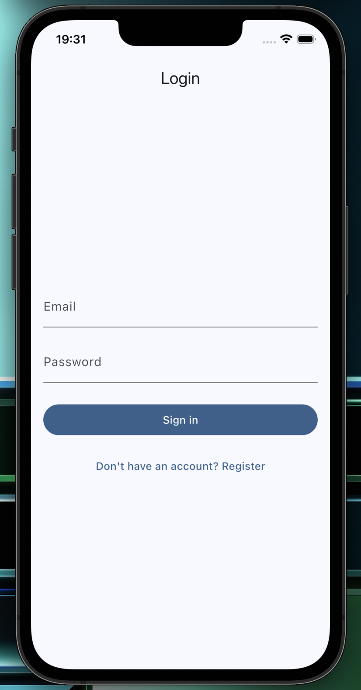
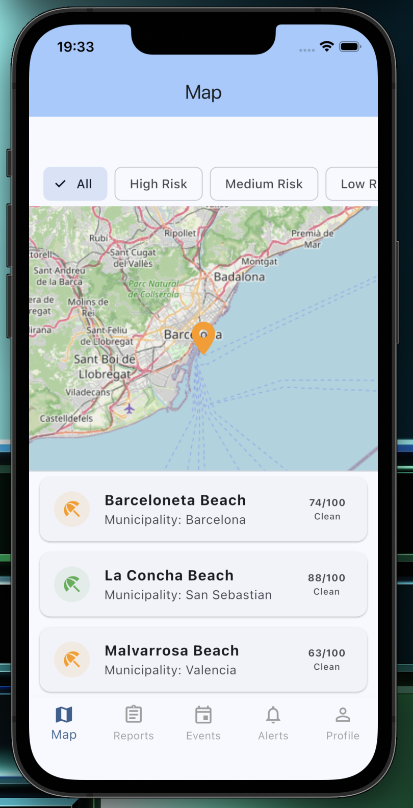
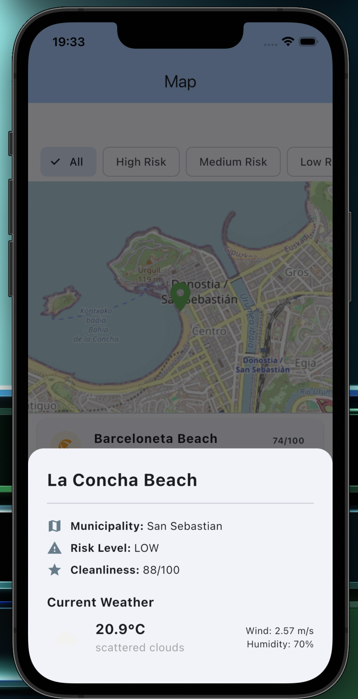
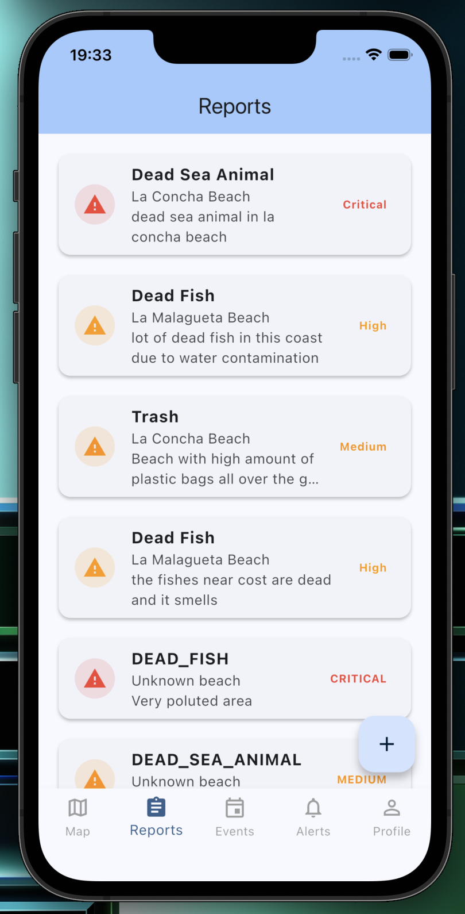
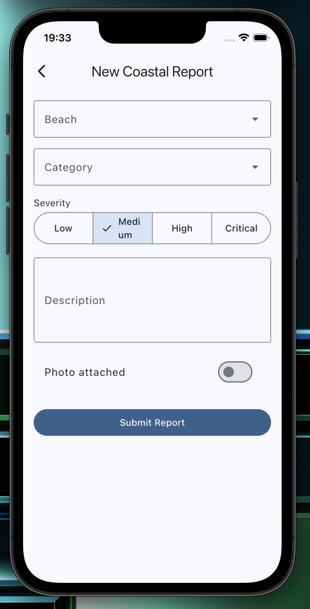
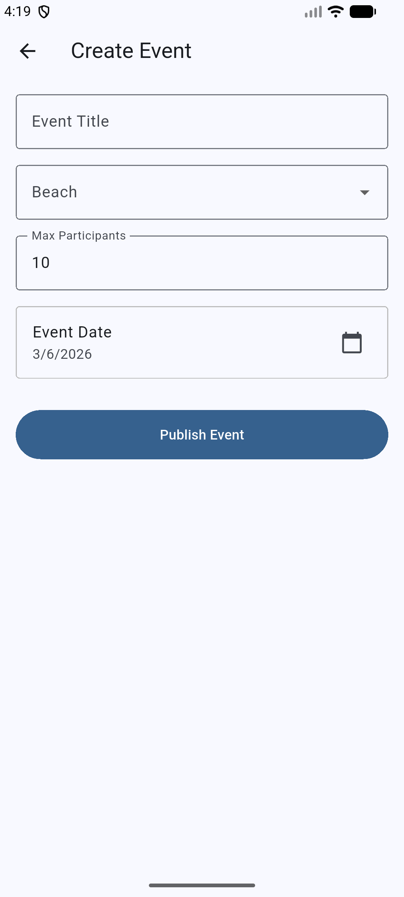
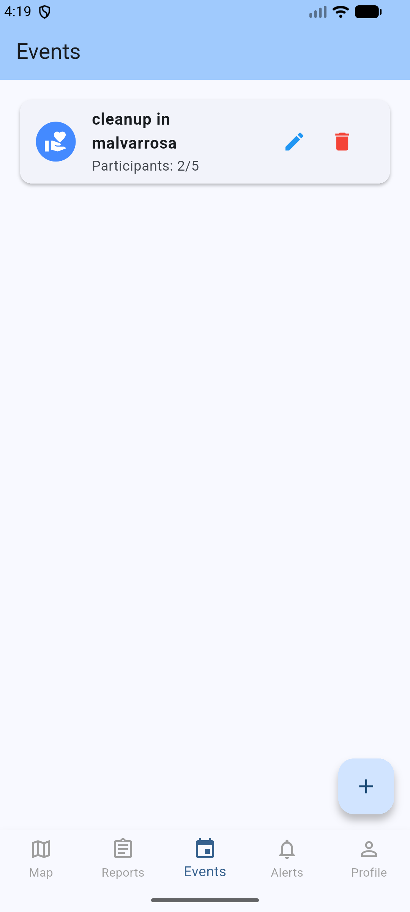
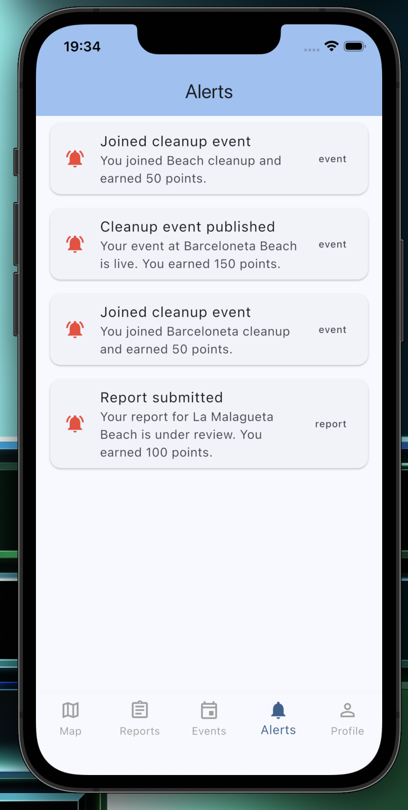
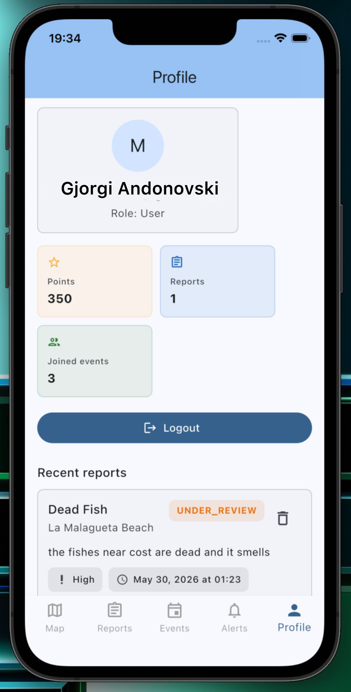

# CoastGuard

## Workspace

### GitHub

- Repository: <https://github.com/gjorgiandonovski/CoastGuardFlutterApp>
- Releases: <https://github.com/gjorgiandonovski/CoastGuardFlutterApp/tags>
- Workspace: <https://upm365.sharepoint.com/sites/MAD-GjorgiAvril/SitePages/Tracking-Flutter-Pr.aspx>

## Description

CoastGuard is a multiplatform app for beach environmental monitoring and community-driven action. Users can report pollution issues at specific beaches, view real-time risk data on an interactive map, join or create cleanup events, browse beach cleanliness scores, and receive in-app alerts about environmental conditions. An admin dashboard allows moderators to verify or reject submitted reports, ensuring data quality.

Compared to existing apps like Clean Swell (Ocean Conservancy) or Marine Debris Tracker, which focus primarily on logging trash during active cleanups, CoastGuard takes a broader approach: it combines issue reporting, community coordination, and beach health monitoring in a single platform. Unlike those apps, CoastGuard includes a risk-scoring system per beach, community comments, and event management, making it useful not just during cleanups, but as an ongoing environmental awareness tool.

## Screenshots And Navigation

| Screen | Screenshot | Description |
| --- | --- | --- |
| Login screen |  | Sign in with email and password, or create a new account. |
| Map and beach list |  | Coastal monitoring map with beach pins and a filterable beach list showing cleanliness scores. |
| Beach Details |  | Beach detail page with cleanliness score, risk level, current weather, and community updates. |
| Reports |  | Browse submitted environmental reports with severity indicators and quick access to create a new report. |
| Report Issue |  | Report an environmental issue by selecting a beach, category, severity, and description. |
| Cleanup Events |  | Browse and join upcoming cleanup events | | Or create your own. |
| Notifications |  | In-app notifications feed for report status updates and event activity. |
| Profile |  | User profile with report and event history. Admin users can access the dashboard from here. |

## Demo Video

https://youtu.be/FeNk2pHj1No

## Features

### Functional

- View beaches on an interactive map with risk level indicators.
- Browse a list of beaches with cleanliness scores and municipality info.
- Submit pollution reports with category, severity, and description.
- Create and join community cleanup events.
- Receive in-app notifications and alerts about beach conditions.
- Read and post comments on individual beach pages.
- See each beach current weather.
- Admin panel to verify or reject submitted reports.

### Technical

- Firebase Authentication: Email/password login and registration.
- Cloud Firestore: Real-time database for beaches, reports, events, comments, and notifications.
- Flutter: Cross-platform app framework used for the project implementation in this repository.
- Dart: Primary application language.
- `flutter_map`: Interactive map support using OpenStreetMap tiles. Ref: `lib/screens/map_screen.dart`
- OpenWeatherMap Api
- Coroutines/stream-style async handling via Dart `Future` and `Stream`.
- Seeded demo data for beaches, events, and reports focused on Spanish coastlines.

## How To Use

1. Open the app and create an account with your email and password, or log in if you already have one.
2. On the Map screen, explore beach pins color-coded by risk level and tap a pin to see details.
3. On the beach list, browse beaches by cleanliness score and municipality.
4. To report an issue, open a beach detail flow and submit the category, severity, and description.
5. To join a cleanup event, go to the Events section and tap `Join`, or create your own event.
6. Check the Notifications feed for alerts and updates on beaches you follow.

## Run Locally

1. Open the project in Android Studio or VS Code with Flutter installed.
2. Run `flutter pub get`.
3. Complete the Firebase setup above.
4. Start the app on an emulator or physical device:

```bash
flutter run
```

If you need an Android debug build directly:

```bash
flutter build apk --debug
```

## Requirements

- JDK 11
- Flutter SDK
- Dart SDK
- Android SDK
- Android `minSdk 24`

## Participants

- Gjorgi Andonovski (`gjorgi.andonovski@alumnos.upm.es`)
- Avril Carmona (`avril.carmona@alumnos.upm.es`)
